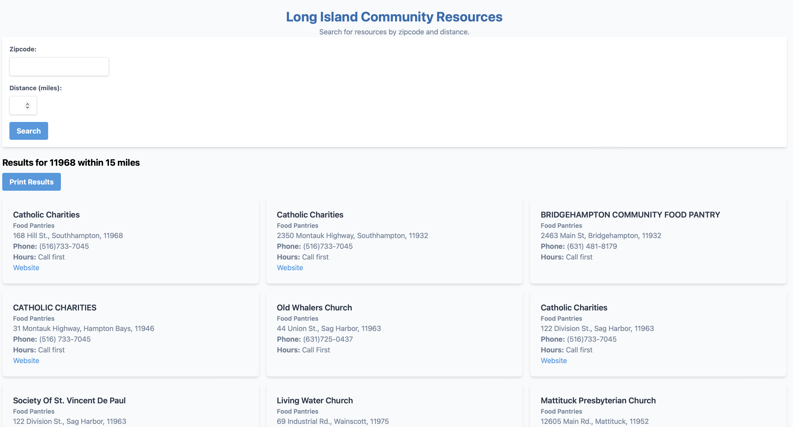

# SDOH Resources

This is a proof of concept of using a flask application with mongoDB for performing geospatial queries. 



## Getting Started

Create a .env file in the root directory, as well as within the test_app if you are planning on running with with docker, with the following variables. Please contact Hants for the ATLAS variables:

```
ATLAS_USERNAME=
ATLAS_PASSWORD=
ATLAS_DB_NAME=
GOOGLE_MAPS_API = 
```

### Prerequisites

You will need to have docker installed on your machine (or your virtual machine).

### Installing

To run the application locally without docker after creating the .env file, you can navigate into the test_app folder and running the following command:

```bash
python app.py
```

If you want to run it with docker, you can run the following command in the test_app directory:

```bash
docker build -t sdoh .
```

Then you can run the following command to run the docker container:

```bash
docker run -p 5005:5001 sdoh
```


